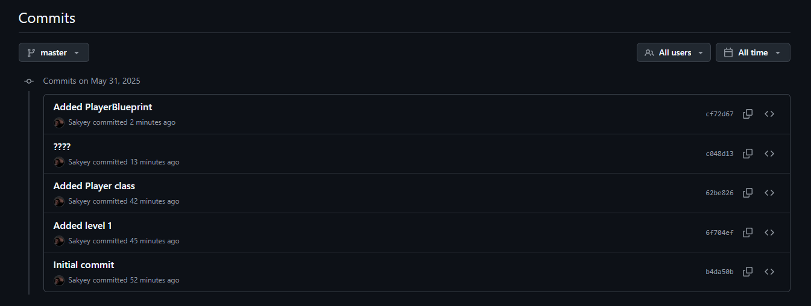
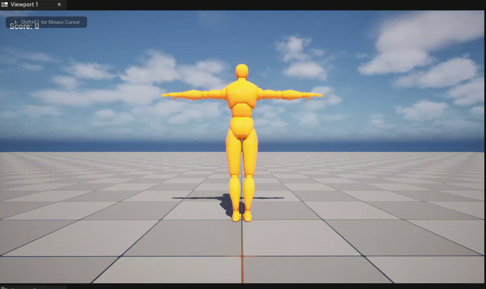

# DA376B_Workshop1

## This repo contains my Workshop 1-5 deliverables for the DA376B course

## Workshop 1

### Objective

- Get familiar with the Unreal Editor UI
- Create a new blank C++ project
- Save a basic level and place a Cube actor
- Create a C++ Character class and turn it into a Blueprint
- Initialize Git source control

### Steps

1. **Project Creation**

   - Engine version: Unreal Engine 5.4
   - Project type: Blank (C++), no Starter Content
   - Folder: `D:\UnrealProjects\DA376B_Workshop1`

2. **Level Setup**

   - Created new level via **File → New Level → Basic**
   - Saved as `Content/Maps/Workshop1_Level.umap`

3. **Cube Placement**

   - Dragged **Cube** from Place Actors panel into scene
   - Adjusted Transform:
     - Location: (X=0, Y=0, Z=50)
     - Rotation: (0, 45, 0)
     - Scale: (1.5, 1.5, 1.5)

4. **C++ Class & Blueprint**

   - Generated `PlayerCharacter` (subclass of ACharacter) via **Tools → New C++ Class**
   - Built project in VS Code
   - Created Blueprint `BP_PlayerCharacter` based on `PlayerCharacter` in `/Content/Blueprints/`

5. **Editor Integration**

   - Set VS Code as Source Code Editor under **Editor Preferences**
   - Generated VS Code project files via **File → Generate Visual Studio Code project**
   - Enabled Live Coding in **Editor Preferences**

6. **Git Initialization**

- Done through guthub Desktop: File -> Create New Repository ->
- Verified in-editor Git (Git Beta plugin) was connected

### Deliverables

- **Project folder** under Git: [`main` branch on GitHub](<[https://github.com/yourusername/DA376B_Workshop1](https://github.com/Sakyey/Workshop_1to5andGame.git)>)
- **Level**: `Workshop1_Level.umap` showing the placed cube
- **C++ class**: `Source/DA376B_Workshop1/PlayerCharacter.*`
- **Blueprint**: `Content/Blueprints/BP_PlayerCharacter.uasset`
- **Screenshot**: GitHub commit history after initial push (see )

---

## Workshop 2

### Objective

- Add a third‐person camera and character movement using Unreal’s Enhanced Input system
- Bind WASD for movement, Mouse X/Y for camera look, and Space Bar for jump
- Extend the `PlayerCharacter` C++ class to include a spring arm, follow camera, and Enhanced Input setup
- Create a new level demonstrating these controls

### Steps

1. **Enable Enhanced Input Plugin**

   - In the Editor, go to **Edit → Plugins**, enable **Enhanced Input**, then restart Unreal.

2. **Create Input Assets**

   - In the **Content Browser**, create an `Input/` folder.
   - Right‐click → **Input → Input Action** to create:
     - `IA_Move` (Value Type = Vector2D)
     - Duplicate to make `IA_Look` (Value Type = Vector2D)
     - Create `IA_Jump` (Value Type = Boolean)
   - Right‐click → **Input → Input Mapping Context** to create `IMC_Player`.
   - Open `IMC_Player` and under **Mappings**, add these entries:
     1. **IA_Move → W** with a **Swizzle (YXZ)** modifier and **Scale (Y=+1)**
     2. **IA_Move → S** with **Swizzle (YXZ)** + **Negate (Y)**
     3. **IA_Move → D** with **Scale (X=+1)** (no modifiers)
     4. **IA_Move → A** with **Negate (X)**
     5. **IA_Look → Mouse X** with **Scale (X=+1)**
     6. **IA_Look → Mouse Y** with **Negate (Y)**
     7. **IA_Jump → Space Bar** (Boolean, no modifiers)

3. **Update C++ Character Class**

   - **New Variables in `PlayerCharacter.h`** (all marked `UPROPERTY`):

     - `USpringArmComponent* SpringArm` – the “camera boom” that holds the camera away from the character
     - `UCameraComponent* FollowCamera` – the actual camera attached to the spring arm
     - `UInputAction* IA_Move`, `UInputAction* IA_Look`, `UInputAction* IA_Jump` – pointers to the three InputAction assets
     - `UInputMappingContext* IMC_Player` – pointer to the mapping context asset

   - **New/Overridden Methods:**

     - `BeginPlay()` – override to grab the local player’s `UEnhancedInputLocalPlayerSubsystem` and call `AddMappingContext(IMC_Player, 0)`, activating the input mappings at runtime
     - `SetupPlayerInputComponent(UInputComponent* InputComponent)` – override to cast to `UEnhancedInputComponent` and bind:
       - `IA_Move` → `APlayerCharacter::Move(const FInputActionValue&)`
       - `IA_Look` → `APlayerCharacter::Look(const FInputActionValue&)`
       - `IA_Jump` → `ACharacter::Jump()` on “Started” and `ACharacter::StopJumping()` on “Completed”
     - `void Move(const FInputActionValue& Value)` – handler that extracts a Vector2D (X = strafe, Y = forward) and calls `AddMovementInput()` accordingly
     - `void Look(const FInputActionValue& Value)` – handler that extracts a Vector2D (X = yaw, Y = pitch) and calls `AddControllerYawInput()` and `AddControllerPitchInput()`

   - **Constructor Changes in `.cpp`**:
     - Instantiate and attach `SpringArm` to the root component, set `TargetArmLength = 300.f` and `bUsePawnControlRotation = true`
     - Instantiate and attach `FollowCamera` to the spring arm’s socket, set `bUsePawnControlRotation = false`

4. **Compile & Resolve Errors**

   - Save the modified `.h` and `.cpp`, then in the Unreal Editor click **Compile** (or press **Ctrl + Alt + F11** for Live Coding).
   - If build errors occur, verify:
     - The `Category="Camera"` spelling is correct on both camera properties
     - Method signatures match exactly (e.g., `SetupPlayerInputComponent(UInputComponent*)`)
     - All necessary includes are present:
       ```cpp
       #include "Camera/CameraComponent.h"
       #include "GameFramework/SpringArmComponent.h"
       #include "EnhancedInputComponent.h"
       #include "EnhancedInputSubsystems.h"
       #include "InputAction.h"
       #include "InputMappingContext.h"
       #include "GameFramework/PlayerController.h"
       ```

5. **Hook Up BP_PlayerCharacter**

   - Open `BP_PlayerCharacter` (subclass of `APlayerCharacter`) in `/Content/Blueprints/`.
   - In **Class Defaults → Input**, assign:
     - **IA_Move** → `/Input/IA_Move`
     - **IA_Look** → `/Input/IA_Look`
     - **IA_Jump** → `/Input/IA_Jump`
     - **IMC_Player** → `/Input/IMC_Player`
   - (Optional) Add a skeletal mesh and basic animation to visually confirm movement.

6. **Create & Configure Workshop2_Level**

   - **File → New Level → Basic**, then **Save As** → `Workshop2_Level.umap` (in `Content/Maps/`).
   - Drag a **Player Start** into the scene.
   - In **Project Settings → Maps & Modes**, set:
     - **Editor Startup Map** = `Workshop2_Level`
     - **Game Default Map** = `Workshop2_Level`
     - **Default GameMode Class** = your custom `BP_GameMode` (with Default Pawn Class = `BP_PlayerCharacter`).

7. **Test in Play-In-Editor**
   - Click **Play**:
     - **W/A/S/D** moves the character forward/back/strafe left/right
     - **Mouse X** rotates the camera around (yaw); **Mouse Y** pitches the camera up/down
     - **Space Bar** makes the character jump
   - If a mesh + animation are assigned, verify that walking/running animations play as the character moves.

### Deliverables

- **Input Assets** in `Content/Input/`:
  - `IA_Move.uasset` (Vector2D action for movement)
  - `IA_Look.uasset` (Vector2D action for camera look)
  - `IA_Jump.uasset` (Boolean action for jump)
  - `IMC_Player.uasset` (Mapping Context with seven mappings: W, A, S, D, Mouse X, Mouse Y, Space Bar)
- **C++ Changes**:
  - New properties added to `PlayerCharacter.h`:
    - `SpringArm`, `FollowCamera`, `IA_Move`, `IA_Look`, `IA_Jump`, `IMC_Player`
  - Overridden methods:
    - `BeginPlay()` registers the mapping context
    - `SetupPlayerInputComponent(...)` binds input actions to `Move()`, `Look()`, and built-in Jump/StopJumping
  - New handler methods in `PlayerCharacter.cpp`:
    - `Move(const FInputActionValue&)` for Vector2D movement
    - `Look(const FInputActionValue&)` for camera rotation
  - Constructor now creates and configures the spring arm and follow camera components
- **Blueprint**:
  - `Content/Blueprints/BP_PlayerCharacter.uasset` (with mesh, Enhanced Input references, and optionally basic animations)
  - `Content/Blueprints/BP_GameMode.uasset` (Default Pawn Class set to `BP_PlayerCharacter`)
- **Level**:
  - `Content/Maps/Workshop2_Level.umap` demonstrating movement, camera look, and jump
- **Video**:  
    
  _(Play-In-Editor capture showing character moving/rotating)_
- **GitHub**:  
  All new assets and code committed to the repository (e.g., [`https://github.com/Sakyey/Workshop_1to5andGame/tree/main`](https://github.com/Sakyey/Workshop_1to5andGame/tree/main))

## Workshop 3

### Objective

- Build a Main Menu (Start / Quit) using UMG
- Create an in‐game Score HUD that displays a `Score` variable from `BP_PlayerCharacter` and updates at runtime
- Learn to bind Blueprint UI widgets to character data and switch input modes between UI and game

### Steps

1. **Create “UI” Folder**

   - In the Content Browser, right-click → **New Folder** → name it `UI`.
   - All Widget Blueprints for Workshop 3 will live here.

2. **Main Menu Widget (`WBP_MainMenu`)**

   1. In `Content/UI`, right-click → **User Interface → Widget Blueprint** → name it `WBP_MainMenu`.
   2. **Designer**:
      - Drag a **Canvas Panel** (if not already present).
      - Inside the Canvas, add two **Button** widgets, anchor both to center.
        - Rename them to `Button_Start` and `Button_Quit`.
        - Inside each Button, place a **Text** block (set Text to “Start” and “Quit” respectively).
        - Set **Is Variable = true** on both Buttons.
   3. **Graph (Event Construct)**:
      - From **Event Construct**, call **Set Input Mode UI Only** (Target = **Get Owning Player**).
      - In **Set Input Mode UI Only** details, check **Show Mouse Cursor**.
   4. **Graph (Button Logic)**:
      - **OnClicked (Button_Start)** → **Open Level (“Workshop2_Level”)** → **Set Input Mode Game Only** (Target = **Get Owning Player**).
      - **OnClicked (Button_Quit)** → **Quit Game** (Target = **Get Owning Player**).
   5. **Compile & Save** `WBP_MainMenu`.

3. **Create Main Menu Level (`Workshop3_MainMenu`)**

   1. **File → New Level → Default** → **Save As** → `Content/Maps/Workshop3_MainMenu.umap`.
   2. **Level Blueprint** (Open Level Blueprint):
      - **Event BeginPlay** → **Create Widget (Class = WBP_MainMenu)** → **Add to Viewport**.
      - **Get Player Controller (0)** → **Set Show Mouse Cursor = true**.
   3. **World Settings (MainMenu_Level)**:
      - Under **GameMode Override**, set to `GM_MainMenu` (Default Pawn = None).
   4. **Project Settings → Maps & Modes** (or override per-map):
      - **Editor Startup Map** = `Workshop3_MainMenu`
      - **Game Default Map** = `Workshop3_MainMenu`
      - **Default GameMode** for `Workshop3_MainMenu` = `GM_MainMenu`

4. **BP_MainMenuGameMode**

   - In `Content/Blueprints`, create a **Blueprint Class → GameModeBase** → name it `GM_MainMenu`.
   - **Class Defaults**: set **Default Pawn Class = None** (no player pawn in the Main Menu).

5. **Workshop 2 Level Configuration**

   - Open `Content/Maps/Workshop2_Level.umap`.
   - In **World Settings**, set **GameMode Override** to `GM_Workshop` (the Workshop 2 GameMode with Default Pawn = `BP_PlayerCharacter`).
   - Save the level.

6. **Score HUD Widget (`WBP_Score`)**

   1. In `Content/UI`, right-click → **User Interface → Widget Blueprint** → name it `WBP_Score`.
   2. **Designer**:
      - Drag a **Text** widget onto the Canvas, anchor to top-left, set **Position (X=10, Y=10)**.
      - Set the Text’s default content to “Score: 0” and check **Is Variable**.
      - Rename it to `Text_ScoreLabel`.
   3. **Graph (Binding Text)**:
      - Select `Text_ScoreLabel` → in Details → **Content → Bind → Create Binding**.
      - In the generated function (`Get_Text_ScoreLabel_Text_0`):
        - **Get Owning Player Pawn** → **Cast to BP_PlayerCharacter** → **Get Score** → **Conv_IntToText** → **Append (“Score: ”)** → **Return**.
   4. **Compile & Save** `WBP_Score`.

7. **Expose `Score` in BP_PlayerCharacter**

   1. Open `BP_PlayerCharacter` in `/Content/Blueprints/`.
   2. Under **My Blueprint → Variables**, click **+** → name it `Score` → set **Type = Integer** → **Default Value = 0**.
   3. **Compile & Save** `BP_PlayerCharacter`.

8. **Add HUD to Player Character**

   1. In `BP_PlayerCharacter → Event Graph`, locate **Event BeginPlay** (or add one).
   2. From **Event BeginPlay** → **Create Widget (Class = WBP_ScoreHUD)** → **Add to Viewport**.
   3. **Compile & Save** the Blueprint.

9. **Increment Score at Runtime** (Test)
   1. In `BP_PlayerCharacter → Event Graph`, right-click → type **Key P** → select **Keyboard P** (Legacy).
   2. From **P (Pressed)** → **Get Score** → **Integer + Integer (Get Score, +1)** → **Set Score**.
   3. **Compile & Save**.
   4. **Play** `Workshop2_Level` → press **P** and verify the HUD text changes:
      ```
      Score: 0 → Score: 1 → Score: 2 → …
      ```

### Deliverables

- **Widget Blueprints (Content/UI/)**
  - `WBP_MainMenu.uasset` (Main Menu with Start/Quit logic)
  - `WBP_Score.uasset` (HUD Text bound to `BP_PlayerCharacter.Score`)
- **Levels (Content/Maps/)**
  - `Workshop3_MainMenu.umap` (Main Menu world, Level Blueprint spawns `WBP_MainMenu`)
  - `Workshop2_Level.umap` (Workshop 2 level, set to `BP_GameMode_Workshop`)
- **Blueprints (Content/Blueprints/)**
  - `GM_MainMenu.uasset` (GameModeBase, Default Pawn None)
  - `BP_PlayerCharacter.uasset` (updated to expose `Score`, create HUD widget, bind input context)
- **Input & Mapping (Content/Input/)**
  - `IA_Move`, `IA_Look`, `IA_Jump`, `IMC_Player` (from Workshop 2)
- **Screenshots / GIF**:
  - 
  - 
- **GitHub**:
  - All new assets committed (branch `main`):  
    [`https://github.com/Sakyey/Workshop_1to5andGame`](https://github.com/Sakyey/Workshop_1to5andGame) (verify Workshop 3 commits present)

## Workshop 4

### Objective

- Add a playable Skeletal Mesh (Remy from Mixamo) and Animation Blueprint (AnimBP) to your existing `BP_PlayerCharacter`
- Create a 1D Blend Space that blends Idle, Walk, and Run animations based on character speed
- Extend the AnimBP’s state machine to handle Jump and Land states (OnGround → InAir → Land → OnGround)
- Hook up the character’s velocity/acceleration variables so the mesh plays the correct animation at the right time

> **Note:** All changes are made directly in the existing project. You will continue using the Main Menu → Workshop2_Level setup from Workshops 1–3. When you click “Start” in the Main Menu, Workshop2_Level will now spawn a Remy-character with full Idle/Walk/Run/Jump/Land animations.

---

### Steps

#### 1. Prepare and Import Mixamo Animations

1. **Obtain Loopable AnimSequences for Remy**

   - On [Mixamo.com](https://www.mixamo.com), select the **Remy** character.
   - Download these five animations (Format = **FBX 7.4 Binary**, Pose = **T-Pose**, Skin = **unchecked**):
     - **Idle**
     - **Walk**
     - **Run**
     - **Jump** (in-air clip)
     - **Land** (landing clip)

2. **Import Animation FBX Files into Unreal**

   - In the Content Browser, create (if needed):
     ```
     Content/
       ├─ Anim/Mixamo/
     ```
   - Drag each FBX file (Idle.fbx, Walk.fbx, Run.fbx, Jump.fbx, Land.fbx) into `Content/Anim/Mixamo/`.
   - In the **FBX Import Options**:
     - **Import Mesh**: ⬜ unchecked (we only need the Animation)
     - **Import Animations**: ✔ checked
     - **Skeleton**: select the **Remy_Skeleton** (Unreal will detect and list the Remy skeleton if you already imported Remy’s mesh; otherwise, import Remy’s T-pose FBX first to create `Remy_Skeleton`).
   - Click **Import**. You should now see five new AnimSequence assets:
     ```
     Idle, Walk, Run, Jump, Land
     ```

3. **Verify Skeleton Compatibility**
   - Open each AnimSequence (Idle, Walk, Run, Jump, Land) and confirm in the Details panel that **Skeleton** = `Remy_Skeleton`.

---

#### 2. Add the Remy Skeletal Mesh to BP_PlayerCharacter

1. **Open** `BP_PlayerCharacter` (Blueprint Editor).
2. **Add/Replace the Mesh Component**
   - In Components, add a **Skeletal Mesh** component named `Mesh` (if none already exists).
   - In Details → **Skeletal Mesh**, select the **Remy** mesh asset.
   - Under **Animation**, leave **Anim Class** blank for now (we’ll assign the AnimBP later).
   - In **Transform**, set **Location = (0, 0, -90)** and **Rotation = (0, -90, 0)** so Remy’s feet align with the Capsule.
3. **Compile & Save**.

---

#### 3. Create the Idle↔Walk↔Run Blend Space for Remy

1. **Create Folder (if needed)**

   - Ensure there’s `Content/Anim/BlendSpace/` in the Content Browser.

2. **New Blend Space 1D**

   - Right-click in `Content/Anim/BlendSpace/` → **Animation → Blend Space 1D**.
   - When prompted, choose `Remy_Skeleton`.
   - Name it:
     ```
     BS_Remy_IdleWalkRun
     ```

3. **Configure Blend Parameters** (Details panel):

   - **Parameter Name**: `Speed`
   - **Axis Min**: `0.0`
   - **Axis Max**: `600.0` (match Remy’s CharacterMovement Max Walk Speed)
   - **Grid Divisions**: `2` (snap points at 0, 300, 600)
   - Click **Apply**.

4. **Place Sample Animations**:

   - Drag **Idle** onto X = 0.0 (far left).
   - Drag **Walk** onto X = 300.0 (middle).
   - Drag **Run** onto X = 600.0 (far right).

5. **Preview** by moving the slider (0 → 150 → 300 → 450 → 600) to verify smooth blending.
6. **Save & Close** the Blend Space.

---

#### 4. Build the Animation Blueprint (ABP_Remy)

1. **Create Folder (if needed)**

   - Ensure there’s `Content/Anim/AnimBP/`.

2. **New Animation Blueprint**

   - Right-click in `Content/Anim/AnimBP/` → **Animation → Animation Blueprint**.
   - Select `Remy_Skeleton`.
   - Name it:
     ```
     ABP_Remy
     ```

3. **Event Graph** (compute Speed, IsFalling, and IsAccelerating)

   - **Variables**:

     - `Speed` (Float)
     - `IsFalling` (Boolean)
     - `IsAccelerating` (Boolean)

   - In **Event Blueprint Update Animation**:

     1. **Try Get Pawn Owner → Cast to BP_PlayerCharacter → (As BP_PlayerCharacter)**
     2. From **As BP_PlayerCharacter → Get Velocity** → **Vector Length** → **Set Speed**.
     3. From **As BP_PlayerCharacter → Get Character Movement → Is Falling** → **Set IsFalling**.
     4. From **As BP_PlayerCharacter → Get Character Movement → Get Current Acceleration** (Vector)
        - Drag off Vector → **Not Equal (Vector)** → second input = **Make Vector(0,0,0)** → **Set IsAccelerating**.

   - (Optional) Insert **Print String** after each Set to verify values during runtime.

4. **AnimGraph → MainState State Machine**

   - Drag off **Result (Final Animation Pose)** → **Add State Machine** → name it `MainState`.

5. **Inside MainState**:

   - **Add Three States**:  
     a. `OnGround`  
     b. `InAir`  
     c. `Land`

   - **OnGround State**:

     - Double-click **OnGround** → inside, drag off from **Entry** → **Blend Space Player (1D)** →
       - In Details, set **Blend Space to Play** = `BS_Remy_IdleWalkRun`.
       - Connect **“X” (Speed)** input to the `Speed` variable.
       - Connect **Blend Space Player → Output Pose**.
     - **Save & Go Back**.

   - **InAir State**:

     - Double-click **InAir** → inside, drag off **Entry** → **Play Animation** → set **Anim to Play** = `Jump` (Looping = false).
     - Connect **Play Animation → Output Pose**.
     - **Save & Go Back**.

   - **Land State**:
     - Double-click **Land** → inside, drag off **Entry** → **Play Animation** → set **Anim to Play** = `Land` (Looping = false).
     - Connect **Play Animation → Output Pose**.
     - **Save & Go Back**.

6. **Set Up Transitions**:

   - **OnGround → InAir**:

     - Draw arrow from **OnGround** → **InAir**.
     - Double-click the arrow → in the rule graph, drag **Get IsFalling** → connect to **Result** (true triggers jump).

   - **InAir → Land**:

     - Draw arrow from **InAir** → **Land**.
     - Double-click the arrow → rule graph: drag **Get IsFalling** → **Not Boolean (NOT)** → connect to **Result** (landing begins when IsFalling becomes false).  
       _(Optionally add “AND Get Relevant Anim Time Remaining Ratio ≤ 0.3” for more precise sync.)_

   - **Land → OnGround**:
     - Draw arrow from **Land** → **OnGround**.
     - Select that transition arrow → in Details, check **Automatic Rule Based on Sequence Player in State** (so when the Land clip finishes, it automatically returns to OnGround).

7. **Compile & Save** the Animation Blueprint.

---

#### 5. Assign ABP_Remy to the Character Mesh

1. **Open** `BP_PlayerCharacter`.
2. Select the **Mesh** component.
3. In Details → **Animation → Anim Class**, choose `ABP_Remy`.
4. **Compile & Save**.

---

#### 6. Test Animations in Workshop2_Level

1. **Press Play** from the Main Menu.
   - Main Menu appears → click **Start** → Workshop2_Level loads.
2. **At Rest** (Speed = 0): Remy stands in the Idle pose.
3. **Hold W/A/S/D**: Remy’s `Speed` increases → BlendSpace smoothly transitions Idle → Walk → Run.
4. **Press Space (Jump)**: `IsFalling` becomes true → transition to **InAir** (Jump animation plays).
5. **Land**: When Remy touches the ground, `IsFalling` becomes false → transition to **Land** (Land animation plays).
6. **After Land finishes**, the **Automatic** rule returns to **OnGround**, and the BlendSpace (Idle/Walk/Run) resumes.

---

### Deliverables

- **Blend Space**

  - `Content/Anim/BlendSpace/BS_Remy_IdleWalkRun.uasset` (Idle at Speed=0, Walk at Speed≈300, Run at Speed≈600)

- **Animation Blueprint**

  - `Content/Anim/AnimBP/ABP_Remy.uasset`
    - Event Graph updates `Speed`, `IsFalling`, `IsAccelerating`.
    - AnimGraph’s `MainState` has OnGround (BlendSpace), InAir (Jump), and Land (Land) states, with transitions as specified.

- **Character Blueprint Update**

  - `Content/Blueprints/BP_PlayerCharacter.uasset` (Mesh assigned to **Remy**, Anim Class set to `ABP_Remy`)

- **Imported Animations**

  - `Content/Anim/Mixamo/Idle` (AnimSequence)
  - `Content/Anim/Mixamo/Walk` (AnimSequence)
  - `Content/Anim/Mixamo/Run` (AnimSequence)
  - `Content/Anim/Mixamo/Jump` (AnimSequence)
  - `Content/Anim/Mixamo/Land` (AnimSequence)

  **Screenshots / GIF**:
  

- **Integration**
  - When you click **Start** from Main Menu → Workshop2_Level, `BP_PlayerCharacter` now spawns as Remy with full Idle/Walk/Run/Jump/Land functionality.

---
